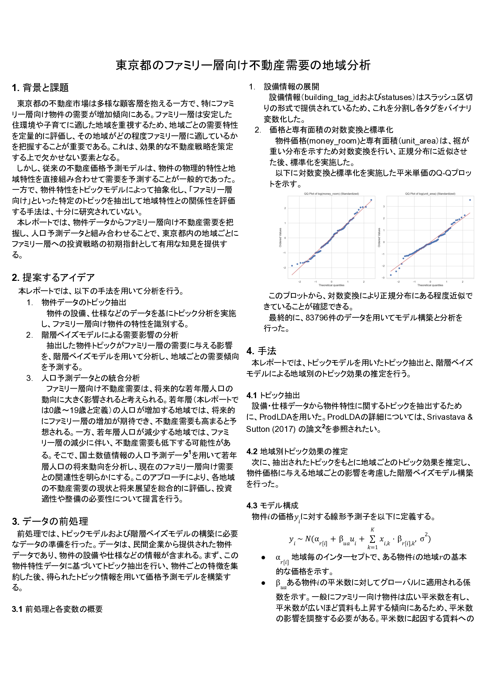
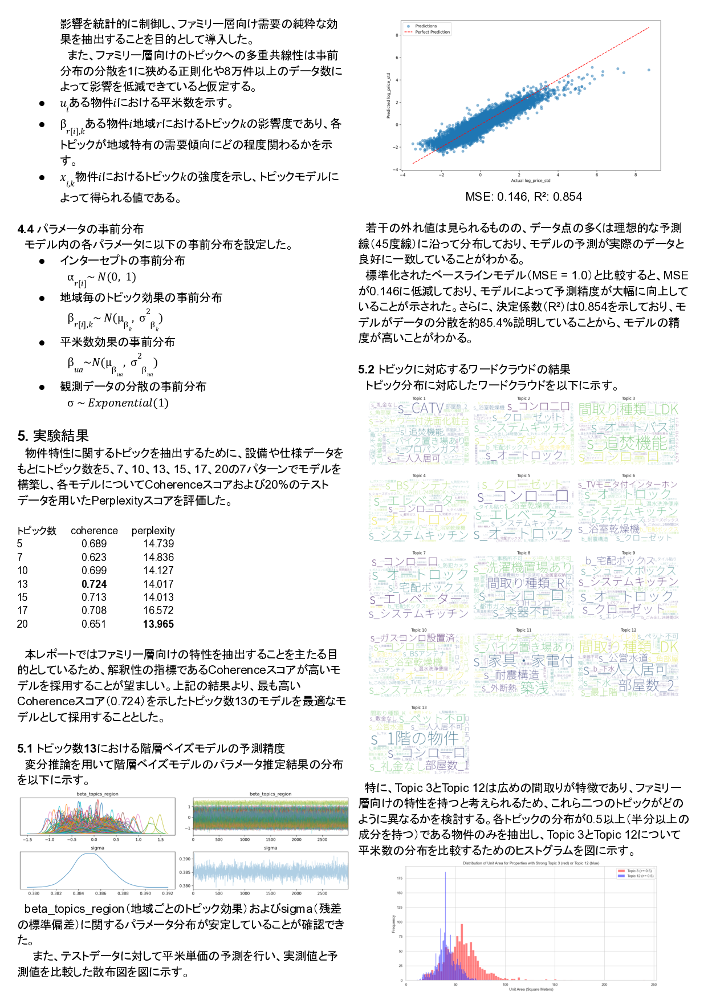
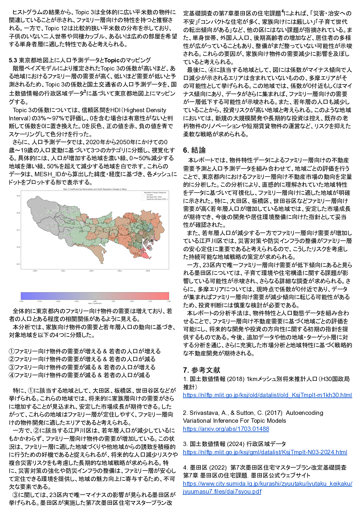

# 東京都 ファミリー層向け不動産需要
### 国土交通省　地理空間情報データチャレンジ　〜国土数値情報編〜　アイデア部門　5位入賞

---

## 1. 背景と課題
- **ファミリー層向け物件の需要が上昇**  
  安定した住環境や子育て支援施設を重視する世帯が増えている。
- **従来モデルの限界**  
  物件の物理的特性と地域特性を直接結合する手法では、  
  “ファミリー向け”といった抽象的な魅力を十分に捉えきれない。
- **目的**  
  物件データをトピック化して「ファミリー適合度」を数値化し、  
  地域人口の将来動向と組み合わせて投資戦略の初期指針を提示する。

---

## 2. 分析フロー
| 手順 | 内容 | 期待されるアウトプット |
|------|------|------------------------|
| **① 物件トピック抽出** | 設備・仕様データから LDA 等でトピック分析。ファミリー向け指標を生成。 | 物件ごとのトピック確率 |
| **② 階層ベイズ需要モデル** | トピックが需要に与える影響を地域レベルで推定。 | 需要影響の事後分布 |
| **③ 人口予測との統合** | 国土数値情報の0–19歳人口予測と掛け合わせ、将来需要を評価。 | 現在需要 × 将来人口 |

---

## 3. レポートプレビュー

---
